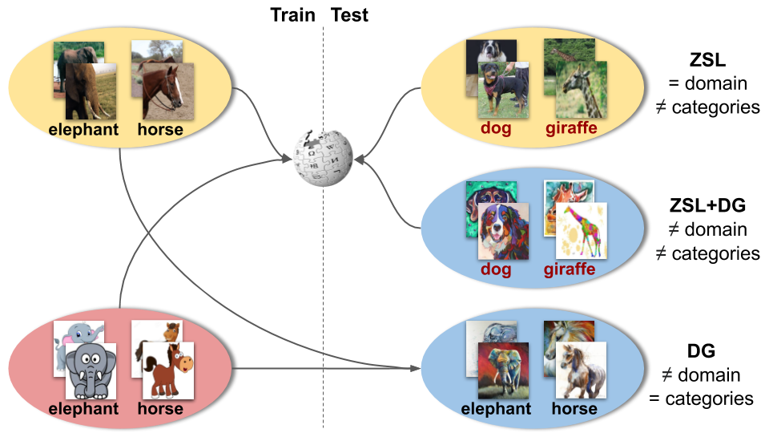

# _CuMix_: Towards Recognizing Unseen Categories in Unseen Domains

This is the official PyTorch code of the method _CuMix_, introduced in our ECCV 2020 work 
["Towards Recognizing Unseen Categories in Unseen Domains"](https://arxiv.org/pdf/2007.12256.pdf).




## Installation
This version has been tested on:
* PyTorch 1.5.1
* python 3.8.3
* cuda 10.2

To install PyTorch, please follow [this](https://pytorch.org/get-started/locally/).

## Zero-Shot Learning experiments
For setting up the datasets, please download CUB, AWA1 and SUN from 
[here](http://datasets.d2.mpi-inf.mpg.de/xian/xlsa17.zip) 
and FLO from [here](http://datasets.d2.mpi-inf.mpg.de/xian/cvpr18xian.zip) and unpack them. 
To download them, 
you can also use the script ```download_zsl.sh```:
```./scripts/download_zsl.sh $ZSL_DESIRED_ROOT```

For reproducing the results, just run the experiments given the corresponding dataset configuration. 
For instance, for CUB: 
```
python -m torch.distributed.launch --nproc_per_node=1 main.py --zsl --target cub --config_file configs/zsl/cub.json --data_root $ZSL_DESIRED_ROOT --name cub_exps_zsl
```
you can find other examples in ```scripts/zsl.sh```.

N.B. To simplify the release, this code does not include 
the validation procedure used to obtain the hyperparameters. In case you need to validate them, 
please DO NOT USE the unseen classes, but the splits given with the datasets.

## Domain Generalization experiments
For setting up the dataset, please download the official train/val/test splits of PACS from 
[here](https://drive.google.com/open?id=0B6x7gtvErXgfUU1WcGY5SzdwZVk), unpacking them. To download them, 
you can also use the script ```download_pacs.sh```:
```./scripts/download_pacs.sh $PACS_DESIRED_ROOT```

For reproducing the results, just run the experiments given the corresponding dataset configuration. 
For instance, for testing with _cartoon_ as target:  
```
python -m torch.distributed.launch --nproc_per_node=1 main.py --dg --target cartoon --config_file configs/dg/dg.json --data_root $PACS_DESIRED_ROOT --name cartoon_exps_dg
```
you can find other examples in ```scripts/dg.sh```. 

## ZSL+DG experiments
For setting up the datasets, please download DomainNet from 
[here](http://ai.bu.edu/M3SDA/), using the cleaned version. In the ```data``` folder, you can find the class splits 
(that we defined) and the embeddings used [here](https://www.sciencedirect.com/science/article/pii/S1077314220300928) . To download the data and set up the folder, 
you can also use the script ```download_dnet.sh```:
```./scripts/download_dnet.sh $DNET_DESIRED_ROOT```

For reproducing the results, just run the experiments given the corresponding dataset configuration.
For instance, for testing with _painting_ as target:  
```
python -m torch.distributed.launch --nproc_per_node=1 main.py --zsl --dg --target painting --config_file configs/zsl+dg/painting.json --data_root $DNET_DESIRED_ROOT --name painting_exps_zsldg
```
you can find other examples in ```scripts/zsldg.sh```. 

## References

If you find this code useful, please cite:

    @inProceedings{mancini2020towards,
	    author = {Mancini, Massimiliano and Akata, Zeynep and Ricci, Elisa and Caputo, Barbara},
  	    title  = {Towards Recognizing Unseen Categories in Unseen Domains},
  	    booktitle = {Proceedings of the European Conference on Computer Vision (ECCV)},
  	    year      = {2020},
  	    month     = {August}
    }

For the ZSL dataloaders and splits, please consider citing:

    @article{xian2018zero,
        title={Zero-shot learning—A comprehensive evaluation of the good, the bad and the ugly},
        author={Xian, Yongqin and Lampert, Christoph H and Schiele, Bernt and Akata, Zeynep},
        journal={IEEE Transactions on Pattern Analysis and Machine Intelligence},
        volume={41},
        number={9},
        pages={2251--2265},
        year={2018},
        publisher={IEEE}
    }

    @inproceedings{xian2018feature,
        title={Feature generating networks for zero-shot learning},
        author={Xian, Yongqin and Lorenz, Tobias and Schiele, Bernt and Akata, Zeynep},
        booktitle={Proceedings of the IEEE Conference on Computer Vision and Pattern Recognition},
        pages={5542--5551},
        year={2018}
    }

for the DG splits:

    @inproceedings{li2017deeper,
        title={Deeper, broader and artier domain generalization},
        author={Li, Da and Yang, Yongxin and Song, Yi-Zhe and Hospedales, Timothy M},
        booktitle={Proceedings of the IEEE international conference on computer vision},
        pages={5542--5550},
        year={2017}
    }

and for the embeddings used in the DomainNet experiments:

    @article{thong2020open,
        title={Open cross-domain visual search},
        author={Thong, William and Mettes, Pascal and Snoek, Cees GM},
        journal={Computer Vision and Image Understanding},
        pages={103045},
        year={2020},
        publisher={Elsevier}
    }


